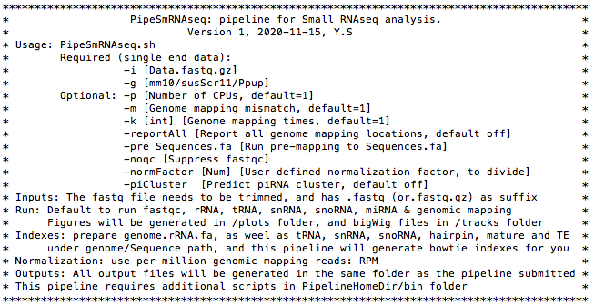
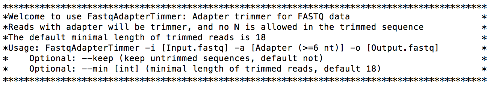

# PipeSmRNAseq
A comprehensive pipeline for small RNAseq data analysis.

Some folder/files are shared with other Pipe* pipelines (i.e. PipeRNAseq and PipeRiboseq), such as the PipelineHomeDir folder, and scripts in /bin folder.

## Software prerequisites
This pipeline is designed to run on Linux servers, and requires the following softwares. They need to be installed and added to the $PATH before using the pipeline.
```
R
Python3
STAR
bowtie
bedtools
samtools
fastqc (optional)
weblogo (optional)
```
The above software can also be installed using conda, as below:
```
#Create pipesmrnaseq environment
conda create --name pipesmrnaseq
conda install -n pipesmrnaseq -c bioconda bowtie
conda install -n pipesmrnaseq -c bioconda star
conda install -n pipesmrnaseq -c bioconda bedtools
conda install -n pipesmrnaseq -c bioconda samtools
conda install -n pipesmrnaseq -c bioconda fastqc
conda install -n pipesmrnaseq -c bioconda weblogo    #This will automatically install python3
conda install -n pipesmrnaseq -c bioconda git
conda install -n pipesmrnaseq -c conda-forge r-base
conda install -n pipesmrnaseq -c bioconda mirdeep2

#Create another env for multiqc if you haven't done this before, due to the conflict with pipesmrnaseq:
conda create --name multiqc_env
conda install -n multiqc_env -c bioconda multiqc

#Activate conda env:
conda activate pipesmrnaseq
```

PipeSmRNAseq.sh is the pipeline script. Other dependencies are in the ./bin folder.

One UCSC tools (from http://hgdownload.soe.ucsc.edu/admin/exe/) is used: faSize. If the binary file the ./bin folder is not working (Execute ./bin/faSize but got errors), please re-download it by choosing the correct version (e.g. linux.x86_64). The faSize for Mac version can be downloaded here: http://hgdownload.soe.ucsc.edu/admin/exe/macOSX.x86_64, and need to be saved in ./bin folder.

Also, for Mac OS, set the pipeline home directory at PipeSmRNAseq.sh manually:
`HomeDir="/Users/yusun/Downloads/PipelineHomeDir"`

We suggest using proTRAC (https://www.smallrnagroup.uni-mainz.de/software.html) to predict piRNA clusters, using mapped small RNAs over 23nt from the `*final.Over23.${genome}.bed6.sorted` file

## Pipeline setup

Here is an example of dm6 genome setup.

1, Download scripts from github to Linux server:

```
git clone https://github.com/sunyumail93/PipeSmRNAseq.git
mv PipeSmRNAseq PipelineHomeDir
```

2, Set up index files for genome mapping
Use Drosophila melanogaster (dm6) genoem as an example

```
cd PipelineHomeDir/Ppup/Sequence

```
3, Set up index files:
```
mkdir PipelineHomeDir/dm6/Index
cd PipelineHomeDir/dm6/Index

#STAR index, set "--genomeSAindexNbases 12" due to small genome size of dm6: 
mkdir STARIndex
STAR --runMode genomeGenerate --genomeDir STARIndex --genomeFastaFiles ../Sequence/dm6.fa --sjdbGTFfile ../Annotation/dm6.RefSeq.reduced.bed12.geneid.gtf --genomeSAindexNbases 12 --sjdbOverhang 100

#bowtie index:
mkdir bowtieIndex
bowtie-build ../Sequence/dm6.fa bowtieIndex/bowtieIndex

#Other index files can be automatically generated when running the pipline.
#Make sure the sequence files for rRNA, tRNA, snRNA, snoRNA, TE are existed in the ./dm6/Sequence folder
```
4, Compile the C++ program if necessary

The FastqAdapterTimmer binary file was compiled on Linux system. It may need to be compiled again:

```
g++ FastqAdapterTimmer.cpp -o FastqAdapterTimmer
```

5, Add executable permissions

```
chmod +x PipeSmRNAseq.sh
chmod +x ./bin/faSize
```

## Pipeline components
```
PipelineHomeDir/
    ├── PipeSmRNAseq.sh
    ├── bin/
    └── dm6/
      └── Annotation/
        ├── dm6.RefSeq.reduced.bed12
        └── dm6.RefSeq.reduced.bed12.geneid.gtf
      └── Index/
        ├── bowtieIndex
        ├── Sm_miRNAAllSpeciesIndex/
        ├── Sm_miRNAIndex/
        ├── Sm_miRNAMatureIndex/
        ├── Sm_rRNAIndex/
        ├── Sm_snoRNAIndex/
        ├── Sm_snRNAIndex/
        ├── Sm_TE/
        ├── Sm_tRNAIndex/
        └── STARIndex/
      └── Sequence/
        ├── dm6.ChromInfo.txt
        ├── dm6.fa
        ├── dm6.fai
        ├── dm6.hairpin.fa
        ├── dm6.mature.fa
        ├── dm6.rRNA.fa
        ├── dm6.snoRNA.fa
        ├── dm6.snRNA.fa
        ├── dm6.TE.fa
        └── dm6.tRNA.fa
    └── Ppup/
       ...
```

Notes: 

1, For the Annotation folder, the GTF file is required for STAR index generation

2, For the Index folder, STAR and bowtie whole genome indexes are big, and it would be better to generate them separately. Other directly bowtie mapping indexes are small and can be generated automatically when running the pipeline.

3, Whole genome sequence and other direct mapping sequences (rRNA, tRNA, snRNA, snoRNA, TE) are in the Sequence folder.

## Usage

Type the pipeline name, then you will see the manual page:

```
PipeSmRNAseq.sh
```

Manual page:



The trimming script also has manual page:

```
FastqAdapterTimmer
```



Sometimes we need more trimming at the 5'-end, for example, trim the first 7nt from the left:

```
FastqSeqClipLeft.py
```


## Examples

A regular run using mostly default parameters:

```
PipeSmRNAseq.sh -i Data.fastq.gz -g dm6
```

More parameters used:

```
PipeSmRNAseq.sh -i Data.fastq.gz -g dm6 -p 8
```

## Run a real data to test the pipeline

1, Download data

Use a public dataset: [GEO SRA: SRR1568355](https://www.ncbi.nlm.nih.gov/sra/SRR1568355[accn])

`fastq-dump` is part of [NCBI SRA Toolkit](https://trace.ncbi.nlm.nih.gov/Traces/sra/sra.cgi?view=software):

```
fastq-dump --split-3 SRR1568355
```

2, Trim adaptor using the trimming script from /bin repository: FastqAdapterTimmer

```
FastqAdapterTimmer -i SRR1568355.fastq -a AGATCG -o Data.trimmed.fastq
gzip Data.trimmed.fastq
```

3, Run the small RNAseq pipeline:

```
PipeSmRNAseq.sh -i Data.trimmed.fastq.gz -g dm6 -p 8
```

## Outputs

1, Length distribution of small RNA all reads, separated by categories:

2, Nucleotide composition analysis
